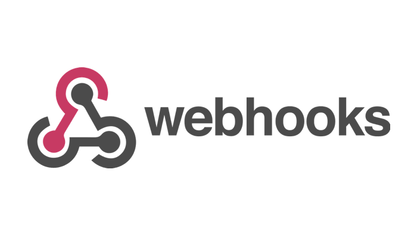

## Webhook Management

This repository contains a simple web application for managing webhooks using JavaScript and XMLHttpRequest. It allows users to create, delete, and retrieve information about their Webhooks, as well as clear pending requests.
## Features

- **Create Webhook**: Enter your bot token and file URL to create a new Webhook.
- **Delete Webhook**: Easily delete the current Webhook.
- **Get Token Info**: Display information about your bot, including its name, username, and bot ID.
- **Clear Pending Requests**: Clear any pending requests and automatically reset the Webhook.

## Usage

- **Create Webhook**: Click the button and enter your bot token and file URL to create a Webhook.
- **Delete Webhook**: Click the button to delete the current Webhook.
- **Get Token Info**: Click the button and enter your bot token to retrieve information about your bot.
- **Clear Pending Requests**: Click the button to clear pending requests and reset the Webhook.

## License
This project is licensed under the MIT License - see [LICENSE](LICENSE) for more details.
## Credits
• This project was created by [ፚ Ꭷ Ꮢ Ꭷ ❥](https://t.me/ZORO2045).

## ☕️ Support My Work  

  

